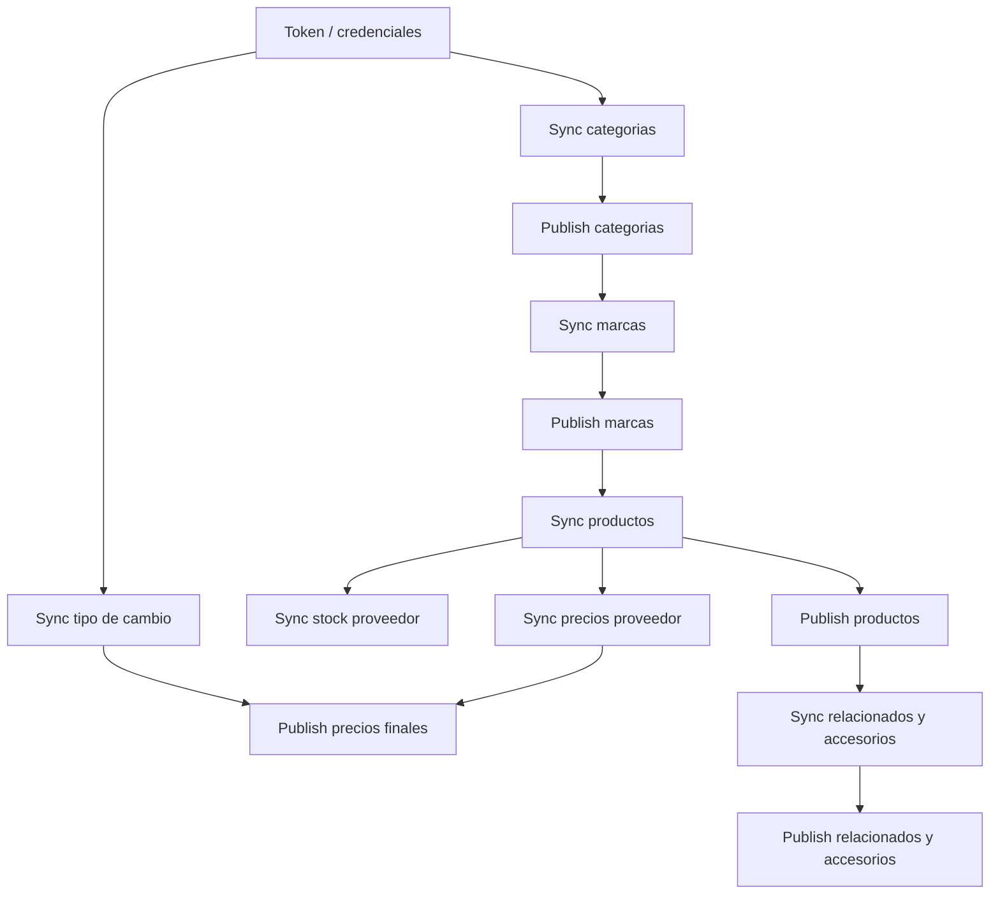

# ETL overview

## Objetivo

Definir el flujo para descargar informacion de proveedores externos, conservarla en `Supplier` y publicarla hacia los modulos internos del ERP.

SYSCOM es el primer proveedor implementado, pero el flujo debe servir para cualquier proveedor futuro.

## Flujo general



## Capas ETL

| Capa | Que hace | Destino |
|---|---|---|
| Extract | Consume APIs del proveedor. | Servicios `supplier/{provider}` |
| Stage | Guarda entidades propias del proveedor. | `Supplier` |
| Transform | Limpia, convierte tipos y normaliza. | Mappers y publishers |
| Load | Publica hacia dominios internos. | `Catalog`, `Pricing`, otros |
| Audit | Guarda logs, conteos y errores. | `SupplierSyncLog` |

## Orden recomendado para SYSCOM

```text
1. sync_syscom_token
2. sync_syscom_categories
3. publish_syscom_categories
4. sync_syscom_brands
5. publish_syscom_brands
6. sync_syscom_products
7. publish_syscom_products
8. sync_syscom_stock
9. sync_syscom_prices
10. sync_syscom_exchange_rate si los costos dependen de USD
11. publish_syscom_prices
12. sync_syscom_related
13. publish_syscom_related
```

`sync_syscom_all` orquesta el flujo principal. Los comandos individuales existen para actualizar solo una parte, por ejemplo precios, stock, categorias o productos.

La ejecucion automatica en Docker esta documentada en `docker-worker.md`. Ese worker usa `sync_syscom_all` para bootstrap/mantenimiento completo y `sync_syscom_fast` para mantener stock y precios durante el dia.

## Entidades afectadas

| Proceso | `sync_*` escribe en | `publish_*` escribe en |
|---|---|---|
| Token | `Supplier.SyscomTokens` | No aplica |
| Categorias | `Supplier.SupplierCategories` | `Catalog.Categories` |
| Marcas | `Supplier.SupplierBrands` | `Catalog.Brands` |
| Productos | `Supplier.SupplierProducts`, `Supplier.SupplierStock`, `Supplier.SupplierPrices` | `Catalog.Products`, imagenes y recursos |
| Stock | `Supplier.SupplierStock` | Futuro puente hacia `Inventory` si aplica |
| Precios | `Supplier.SupplierPrices` | `Pricing.ProductPrices` |
| Tipo de cambio | `Supplier.SupplierExchangeRates` | `Pricing.CurrencyRate` o snapshot usado por Pricing |
| Relacionados | `Supplier.SupplierProductRelations` | `Catalog.ProductRelations` |

## Principios de carga

- Todo proceso que actualiza maestros debe ser idempotente.
- Stock y precios de proveedor pueden ser historicos.
- Cada ejecucion debe generar log o, al menos, reporte operativo.
- Un error en un producto no debe detener todo el lote.
- Los datos crudos deben preservarse en `RawData`.
- `Supplier` no representa el producto final; representa lo que dijo el proveedor.
- `Catalog` no descarga del proveedor; recibe informacion publicada desde `Supplier`.
- Si los costos proveedor vienen en USD o dependen de dolar, se debe sincronizar tipo de cambio antes de publicar precios finales.

## Idempotencia

| Entidad | Llave de idempotencia |
|---|---|
| Supplier | `Code` |
| SupplierCategory | `Supplier + ExternalId` |
| SupplierBrand | `Supplier + ExternalId` |
| SupplierProduct | `Supplier + ExternalProductId` |
| SupplierStock | Historico por `SupplierProduct + CapturedAt` |
| SupplierPrice | Historico por `SupplierProduct + PriceType + CapturedAt` |
| SupplierExchangeRate | Historico por `Supplier + RateType + CapturedAt` |
| Catalog.Category | `Provider + ExternalId`, si existe campo externo |
| Catalog.Brand | `Provider + ExternalId`, si existe campo externo |
| Catalog.Product | `Provider + ExternalProductId`, si existe campo externo |
| Pricing.ProductPrice | `Product + PriceList + Currency`, segun regla de negocio |

## Historicos

Se recomienda conservar historico para:

- Stock reportado por proveedor.
- Costo/precio de proveedor.
- Tipo de cambio proveedor.
- Precio final calculado.
- Logs de sincronizacion.

Esto permite auditar cambios de disponibilidad, costo y margen sin depender de logs externos.
