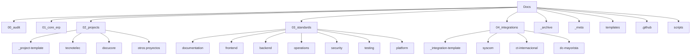
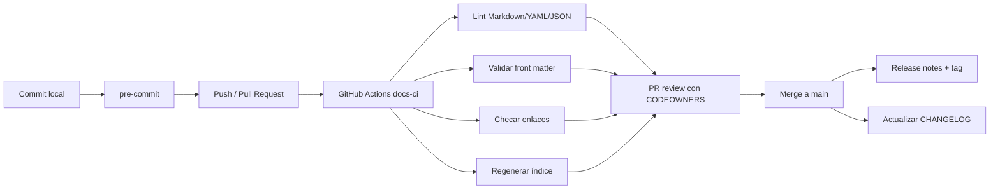

# Investigación profunda del repositorio MexIngSoft Docs

## Resumen ejecutivo

El repositorio **`MexIngSoft/Docs`** es, en esencia, un repositorio documental para un ecosistema ERP modular y varios proyectos de negocio. Su README define una taxonomía canónica basada en cinco bloques principales —`00_audit`, `01_core_erp`, `02_projects`, `03_standards` y `04_integrations`—, pero la raíz real del repositorio también incluye directorios de soporte y excepción como `_archive`, `_meta`, `agents`, `pendientes`, `tecnotelec-ui` y `templates`. Esa combinación muestra una intención clara de orden, pero también una segunda capa de “soporte operativo” que hoy no está explicada con la misma claridad en la vista canónica principal. citeturn41view0turn29view3

La fortaleza principal del repositorio es su **profundidad conceptual**. Hay una separación útil entre núcleo ERP reutilizable, proyectos específicos, estándares operativos y documentación de integraciones. El índice maestro `_meta/master-index.md` organiza documentos por dominio, ruta, estado, prioridad y owner; además, hay material maduro sobre pruebas, manejo de errores, seguridad, observabilidad, políticas de secretos y runbooks operativos. También hay una fuerte documentación del proyecto **Tecno Telec**, una integración **SYSCOM** relativamente madura, y una taxonomía suficientemente rica para reutilizarse en futuros proyectos. citeturn29view4turn31view0turn32view0turn33view0turn25view0turn23view0turn26view0turn27view0

La debilidad principal no es de contenido, sino de **gobernanza y automatización del repositorio**. En la revisión pública no se observan un archivo `LICENSE`, una carpeta `.github`, flujos en `.github/workflows`, archivos visibles de salud comunitaria por repositorio, ni lanzamientos publicados. GitHub recomienda este tipo de archivos y permite centralizar guías, plantillas y políticas; además, define que los workflows deben vivir en `.github/workflows` y que los releases son una forma estándar de empaquetar y publicar iteraciones del software. En paralelo, el propio `_meta/quality_gate_report.md` advierte que muchos documentos antiguos no tienen front matter obligatorio y que `tecnotelec-ui` está fuera de la estructura canónica. citeturn41view0turn42view0turn44view0turn44view2turn44view3turn29view2

Mi conclusión es que el repositorio **ya tiene una buena arquitectura documental “de dominio”**, pero todavía no tiene una arquitectura documental “de plataforma”. Para reducir duplicación y escalar mejor a proyectos futuros, conviene tratar este repositorio como **fuente única de estándares, plantillas, metadatos y automatización**, sin convertirlo en un monorepo de código. Esa dirección además es coherente con el mapa de repositorios Git del propio repositorio, que insiste en separar responsabilidades por repositorio y no mezclar todo el workspace en un único historial. citeturn27view6turn24view2

## Estado actual del repositorio y revisión estructural

`README.md` describe el repositorio como la documentación del ERP modular y de los proyectos que lo utilizan. La raíz visible contiene las carpetas canónicas ya mencionadas, además de `_archive`, `_meta`, `agents`, `pendientes`, `tecnotelec-ui`, `templates`, `.gitignore` y el propio `README.md`. El README también establece reglas fuertes, como no duplicar documentos entre núcleo y proyecto, no mezclar negocio con arquitectura técnica y mover fuentes antiguas a `_archive`. Esa base conceptual es buena, pero la raíz real ya evolucionó más allá de lo que el README resume como “estructura canónica”. citeturn41view0

En **`01_core_erp`** la estructura es consistente y madura. Se organiza por áreas funcionales como `apis`, `architecture`, `auth`, `database`, `erp` y `flows`, cada una con archivos secuenciados y nombres descriptivos. Además, `_meta/master-index.md` confirma que el núcleo concentra APIs reutilizables, arquitectura general, entidades, modelos de datos y flujos transversales, con varios documentos en estado `ACTIVE` y otros en `FUTURE_OR_PENDING`. Esta parte es la más cercana a una documentación escalable y modular. citeturn19view4turn19view5turn19view6turn19view7turn19view8turn20view1turn31view0

En **`02_projects`** aparece la mayor heterogeneidad estructural. `tecnotelec` usa un esquema profundo y por dominio —`auth`, `backend`, `business`, `cart`, `catalog`, `decisions`, `frontend`, `pricing`, `quotes`, `solutions`, `tasks`— y su README explica la intención de cada carpeta. En cambio, `docucore` usa un modelo plano con archivos como `architecture.md`, `database.md`, `docker.md`, `security.md` y `repositories.md` en la raíz del proyecto. Otros proyectos, como `mexingsof`, parecen tener únicamente un `README.md`. Eso indica tres niveles distintos de madurez documental dentro de una sola capa de proyectos: plantillas mínimas, estructura plana y estructura profunda. citeturn36view0turn35view0turn36view2turn31view0turn32view0

En **`03_standards`** hay bastante valor, pero también mezcla de responsabilidades. Existen subcarpetas claras como `frontend`, `operations`, `security`, `testing` y `database`, pero al mismo tiempo hay archivos de documentación general directamente en la raíz de `03_standards`, por ejemplo `documentation-maintenance-policy.md`, `documentation-pr-checklist.md` y `docker.md`. El resultado es funcional, pero no homogéneo: unas áreas tienen subdominio propio y otras siguen como archivos sueltos. Esto complica la escalabilidad conforme crezca el número de estándares. citeturn14view1turn14view2turn14view3turn19view1turn19view2turn19view3turn19view10turn33view0

Dentro de estándares, el contenido existe pero la ejecución aún no está cerrada. `observability.md` define logs estructurados, `correlation_id`, métricas por comando y por proveedor; `error-handling.md` define reintentos, errores fatales/no fatales y logging por producto; `testing/testing-strategy.md` establece pruebas unitarias, de integración, operativas y de contrato; `secrets-management.md` fija reglas para `.env.local` y `.env.local.example`; y `runbook.md` describe procedimientos operativos. Sin embargo, el índice maestro marca `observability.md`, `runbook.md`, `nextjs-project-standard.md` y `mfa-future.md` como `FUTURE_OR_PENDING`, lo que sugiere que el estándar existe en papel, pero no necesariamente como política cerrada y aplicada de forma automática. citeturn25view0turn23view0turn26view0turn27view0turn25view3turn33view0

En **`04_integrations`** también se ve una gradación de madurez muy clara. `syscom` tiene una estructura por `api_reference/` y `etl/`, mientras que `ct-internacional` y `dc-mayorista` solo contienen un `README.md` con `PENDIENTE_DE_DEFINIR` y un inventario de información requerida. Esto es útil como backlog, pero confirma que hace falta una plantilla única de integración para que nuevos proveedores nazcan desde una base comparable. citeturn37view0turn38view0turn38view1turn33view0

La capa de **metadatos** es uno de los activos más interesantes del repositorio. `_meta` contiene `master-index.md`, `master-index.yaml`, `document_inventory.json`, `document_classification.json`, `owners.md`, `proposed_structure.md` y `quality_gate_report.md`. Esa riqueza sugiere un intento serio de catalogación y trazabilidad, pero también apunta a una responsabilidad repartida en varios archivos paralelos que potencialmente pueden desalinearse si siguen siendo mantenidos a mano. El propio `quality_gate_report.md` ya advierte carencias de front matter y una ubicación dudosa para `tecnotelec-ui`. citeturn5view4turn29view2turn29view4turn29view5

Las **plantillas** existen, lo cual es positivo, pero las que pude revisar comparten casi el mismo esqueleto de front matter y bloques base, con diferencias menores de tipo. Eso indica oportunidad clara de simplificación: conviene pasar de varias plantillas casi idénticas a una plantilla documental base más pequeñas extensiones por categoría. Al mismo tiempo, el directorio `agents/` existe a nivel raíz y `_meta/owners.md` le asigna ownership, pero `_meta/master-index.md` no muestra entradas de `agents/`, lo que deja una zona de gobernanza parcialmente fuera del catálogo central. citeturn29view5turn34view0

La siguiente tabla resume la diferencia entre la situación actual y una estructura propuesta, utilizando como base la revisión de `README.md`, `_meta/proposed_structure.md`, `_meta/master-index.md`, el reporte de calidad y los directorios de proyectos e integraciones. citeturn41view0turn29view3turn29view4turn29view2turn35view0turn36view0turn37view0

| Área | Estructura actual | Estructura propuesta |
|---|---|---|
| Raíz | Canónica en el README, pero con directorios adicionales no explicados al mismo nivel: `_meta`, `agents`, `pendientes`, `tecnotelec-ui`, `templates` | Mantener los cinco bloques de negocio y añadir explícitamente una capa de plataforma: `.github/`, `scripts/`, `templates/`, `_meta/`, `_archive/visual_sources/` |
| Proyectos | Tres patrones simultáneos: profundo (`tecnotelec`), plano (`docucore`) y mínimo (`mexingsof`) | Un solo esqueleto por proyecto con carpetas obligatorias y opcionales, generado por plantilla |
| Estándares | Mezcla de subcarpetas y archivos sueltos directamente en `03_standards` | Separar por dominios estables: `documentation/`, `frontend/`, `backend/`, `operations/`, `security/`, `testing/`, `platform/` |
| Integraciones | `syscom` madura; `ct-internacional` y `dc-mayorista` solo con README pendiente | Plantilla única por proveedor con `README`, `metadata.yaml`, `api_reference/`, `etl/`, `mappings/`, `operations/` |
| Metadatos | Índice maestro, YAML, inventario y clasificación coexistiendo | Un solo origen de verdad en front matter + generadores automáticos para índices e inventarios |
| Gobernanza | No se observan `.github`, `LICENSE`, workflows ni releases publicados | Salud comunitaria mínima, CODEOWNERS, CI documental, changelog y releases automáticos |

## Áreas débiles y riesgos

La primera área débil es la **gobernanza del repositorio**. GitHub documenta explícitamente el valor de archivos como `CONTRIBUTING`, `CODE_OF_CONDUCT`, `SECURITY`, `SUPPORT`, plantillas de issues y PR, y también aclara que la licencia debe agregarse por repositorio. En la revisión pública del repositorio no se observan esos archivos en la raíz ni una carpeta `.github` visible; tampoco se ve un `LICENSE`. Para un repositorio público que aspira a ser fuente de verdad documental, esa ausencia baja la mantenibilidad y dificulta la colaboración estructurada. citeturn41view0turn42view0

La segunda área débil es la **ausencia de automatización verificable a nivel repo**. GitHub define los workflows como procesos automatizados configurables basados en YAML dentro de `.github/workflows`. En este repositorio no aparece dicha carpeta en la estructura visible, y por tanto no hay evidencia pública de linting de Markdown, validación de YAML/JSON, chequeo de enlaces, generación de índices ni publicación automática. En un repositorio mayoritariamente documental, esa carencia hace que la calidad dependa demasiado del mantenimiento manual. citeturn41view0turn44view0

La tercera área débil es la **duplicación de responsabilidad en metadatos**. Hay un índice maestro en Markdown, otro en YAML, al menos un inventario en JSON, una clasificación en JSON, reportes de calidad y propuestas de estructura. Esa riqueza es valiosa, pero si todos esos artefactos se editan manualmente, la deuda de sincronización será alta. El reporte de calidad ya confirma que hay problemas de front matter y cierta estructura fuera de canon. La recomendación aquí no es eliminar metadatos, sino volverlos **derivados automáticamente** a partir de una fuente única. citeturn5view4turn29view2turn29view4

La cuarta área débil es la **inconsistencia estructural entre proyectos**. El README raíz prohíbe duplicar núcleo y proyecto, pero la capa `02_projects` muestra estilos documentales distintos: `tecnotelec` está profundamente organizado, `docucore` está aplanado y otros proyectos sólo tienen `README`. Eso vuelve costoso automatizar navegación, ownership, plantillas, auditorías o generación de índices por proyecto. A futuro, cada nuevo proyecto amplificará esa divergencia si no nace de una plantilla única. citeturn41view0turn35view0turn36view0turn36view2

La quinta área débil es que **varios estándares existen como documento, pero no como enforcement**. El repositorio sí contiene una estrategia de pruebas, reglas de observabilidad, manejo de errores y manejo de secretos. El problema es que no se ve una traducción de esas reglas a checks de CI, hooks locales, plantillas de PR o scripts de validación. En otras palabras: hay estándar semántico, pero no estándar ejecutable. citeturn25view0turn23view0turn26view0turn27view0turn44view0

La sexta área débil es el **versionado y proceso de publicación**. GitHub muestra que no hay releases publicados para este repositorio, y la documentación oficial de GitHub explica que los releases son iteraciones empaquetables y distribuibles. Si este repositorio va a consolidar estándares organizacionales, conviene poder versionar cambios relevantes y generar changelogs. semantic-release está diseñado justamente para automatizar la gestión de versiones, las notas de publicación y la publicación misma a partir de convenciones formales de commits y CI. citeturn41view0turn44view2turn44view3turn45view0

La séptima área débil es la **seguridad y supply chain del propio repositorio**. Aunque hay documentos sobre passwords, MFA futuro, auditoría y secretos, no se ve un `SECURITY.md` de repositorio ni un flujo visible para escaneo de dependencias o de tooling. OWASP Dependency-Check es una herramienta SCA oficial para detectar vulnerabilidades públicas en dependencias y además se integra con GitHub Actions. Esto importa incluso en un docs repo, porque los linters, generadores, scripts o acciones también forman parte de la cadena de suministro. citeturn27view0turn27view1turn46view0turn46view1

La octava área débil es la **ausencia visible de estándares de accesibilidad e internacionalización**. En `03_standards/frontend` los archivos visibles se enfocan en placeholders, visibilidad, checklist previo, estándar Next.js y arquitectura Docker compartida, pero no aparece una guía explícita de accesibilidad o i18n/l10n. W3C define la internacionalización como diseñar y desarrollar un producto para facilitar su localización a distintas culturas, regiones o lenguas. Si el ecosistema contempla frontends públicos, conviene capturar ese estándar desde ahora, no después. citeturn19view1turn41view0turn46view3turn46view4

## Estructura objetivo y convenciones recomendadas

Mi recomendación es **preservar la lógica general del repositorio** —audit, core, projects, standards, integrations— porque ya es una buena decisión, pero convertirla en una estructura de plataforma explícita. La clave no es “reorganizar por reorganizar”, sino hacer cuatro cosas de fondo: clarificar la raíz, normalizar plantillas, centralizar metadatos y automatizar validaciones. Eso respeta la decisión del repositorio de no tratar el workspace completo como un monorepo, y en cambio convierte `Docs` en una base reusable para todos los demás repositorios. citeturn27view6turn24view2

La estructura objetivo que propongo es esta:



Para **nuevos proyectos** recomiendo una plantilla única, con carpetas obligatorias y opcionales. Las obligatorias deberían ser `README.md`, `project.yaml`, `decisions/`, `tasks/` y al menos una carpeta entre `business/`, `frontend/`, `backend/` u `operations/`, según el tipo de proyecto. Las opcionales podrían incluir `pricing/`, `catalog/`, `auth/`, `quotes/`, `solutions/` y `assets/`. La idea es no obligar a todos los proyectos a tener la profundidad de `tecnotelec`, pero sí hacer que todos nazcan con el mismo esqueleto mínimo y con metadatos legibles por máquina. Eso resolvería la divergencia actual entre `tecnotelec`, `docucore` y los proyectos “solo README”. citeturn36view0turn35view0turn36view2

Para **integraciones nuevas** recomiendo una plantilla que incluya: `README.md`, `metadata.yaml`, `api_reference/`, `etl/`, `mappings/`, `operations/`, `security/` y `changelog.md`. El estándar actual para integrar proveedores ya pide documentar endpoints, mappers, writers, publishers y comandos `sync_*` / `publish_*`; por tanto, una plantilla de integración no inventaría nada nuevo, solo haría ese estándar repetible desde el primer commit. También le daría más simetría a proveedores futuros como CT Internacional y DC Mayorista, que hoy solo están en estado placeholder. citeturn24view7turn38view0turn38view1

En cuanto a **convenciones documentales**, sugiero un front matter YAML mínimo y obligatorio para todo documento nuevo:

```yaml
---
id: TT-FE-001
title: Frontend overview
domain: business
subdomain: frontend
status: active
priority: p1
owner: owner-de-proyecto
last_reviewed: 2026-06-12
source_of_truth: true
related_paths:
  - 03_standards/frontend/pre-development-checklist.md
tags:
  - frontend
  - tecnotelec
  - workflow
---
```

Ese front matter permitiría regenerar `_meta/master-index.md`, `_meta/master-index.yaml`, inventarios JSON y reportes de calidad sin edición manual. El propio `quality_gate_report.md` ya empuja en esta dirección al señalar la falta de front matter como warning principal. citeturn29view2

Para los **nombres de archivos**, mi criterio sería el siguiente. Mantener numeración solo donde haya una secuencia real de lectura (`00_`, `01_`, `02_`), usar `kebab-case` para archivos de estándares y operaciones, y reservar `adr-0001-*` para decisiones de arquitectura. Hoy conviven numeración, nombres largos con guiones, y patrones por repo externo como `API.PY.DJANGO.*` o `WEB.NJ.NEXT.*`. Esa mezcla no es incorrecta, pero sí puede simplificarse distinguiendo mejor entre documentación interna, nombres de repositorios externos y artefactos de soporte. citeturn24view2turn27view3turn36view0

## Recomendaciones priorizadas

La tabla siguiente ordena las recomendaciones por prioridad, esfuerzo e impacto. El esfuerzo está estimado solo para **este repositorio documental**, no para la instrumentación completa en los repositorios de código que este repositorio describe.

| Prioridad | Recomendación | Esfuerzo | Impacto | Resultado esperado |
|---|---|---:|---:|---|
| Alta | Crear `.github/` con `CONTRIBUTING.md`, `SECURITY.md`, `SUPPORT.md`, plantillas de issue/PR y `CODEOWNERS` | Bajo | Alto | Gobernanza mínima visible y revisiones por ownership |
| Alta | Añadir CI documental en `.github/workflows/docs-ci.yml` | Medio | Alto | Validación automática de Markdown, YAML, JSON, enlaces y front matter |
| Alta | Definir front matter obligatorio y generar `_meta/*` automáticamente | Medio | Alto | Menos desalineación entre índice, inventarios, owners y reportes |
| Alta | Unificar plantilla de proyecto y migrar `docucore` a esa estructura | Medio | Alto | Menor duplicación y navegación homogénea para proyectos actuales y futuros |
| Alta | Mover `tecnotelec-ui/` a `_archive/visual_sources/tecnotelec-ui/` y explicar directorios de soporte en `README.md` | Bajo | Medio | Menos ambigüedad entre canon y excepciones |
| Media | Reorganizar `03_standards/` en subdominios estables, moviendo archivos raiz hoy dispersos | Medio | Alto | Estandares más fáciles de encontrar y escalar |
| Media | Añadir `CHANGELOG.md`, etiquetas y release workflow con semantic-release | Medio | Alto | Versionado consistente y trazabilidad de cambios |
| Media | Instalar `pre-commit` y linter stack multi-lenguaje | Bajo | Alto | Menos errores triviales antes del PR y menos scripts copiados a mano |
| Media | Incorporar escaneo de dependencias/tooling con OWASP Dependency-Check y Dependabot o equivalente | Medio | Medio | Mejor postura de seguridad del pipeline documental |
| Media | Crear estándar explícito de accesibilidad e i18n para frontends públicos | Medio | Medio | Menos deuda futura en UX pública y localización |
| Baja | Revisar y modernizar `.gitignore` para este repo documental | Bajo | Medio | Ignorados coherentes con artefactos reales del repositorio |
| Baja | Añadir metadatos de About del repositorio: descripción, temas y website si aplica | Bajo | Bajo | Mejor descubribilidad y contexto público |

Además de archivos y automatización, recomiendo formalizar ciertas **responsabilidades** nuevas:

| Responsabilidad | Alcance |
|---|---|
| Documentation steward | Mantener estructura, taxonomía, front matter y generación de índices |
| Repo automation owner | Mantener workflows, hooks, scripts y calidad documental |
| Security owner | Custodiar `SECURITY.md`, escaneos y políticas de secretos |
| Release owner | Validar changelog, tags y publicación documental |
| Domain owners | Aprobar cambios en `01_core_erp`, `02_projects`, `03_standards` y `04_integrations` vía `CODEOWNERS` |

GitHub documenta `CODEOWNERS` precisamente para asignar responsables por rutas y disparar revisiones en pull requests, lo cual encaja muy bien con esta separación por dominios. citeturn44view1turn44view4

## Cambios concretos por archivo y contenido propuesto

Los cambios siguientes son los más rentables porque corrigen vacíos de gobernanza, homogenizan estructura y reducen mantenimiento manual.

**`README.md`**  
Debe actualizarse para distinguir entre **estructura canónica de negocio** y **directorios de soporte de plataforma**. Hoy el README resume bien los cinco bloques principales, pero no normaliza visualmente `_meta`, `agents`, `templates`, `pendientes` ni `tecnotelec-ui`, aunque varios de ellos están en la raíz real y también aparecen en `_meta/proposed_structure.md` o en el índice maestro. citeturn41view0turn29view3turn33view0

Snippet sugerido:

```md
## Directorios de soporte

Además de la estructura canónica funcional, este repositorio incluye:

- `.github/`: gobernanza, plantillas y workflows.
- `_meta/`: índices y reportes generados.
- `templates/`: plantillas reutilizables para nuevos documentos.
- `scripts/`: automatización de validación y generación.
- `_archive/visual_sources/`: fuentes visuales y referencias históricas.
```

**`.gitignore`**  
El `.gitignore` actual es extremadamente corto, ignora rutas de workspaces externos y repite `Docker.API.PY/`. No está orientado a artefactos típicos de un repositorio documental con automatización moderna. citeturn39view0

Snippet sugerido:

```gitignore
# OS / editor
.DS_Store
Thumbs.db
.vscode/
.idea/

# Python
.venv/
__pycache__/
.pytest_cache/
.mypy_cache/
.ruff_cache/

# Node
node_modules/
.npm/
.pnpm-store/

# Generated docs/meta
_site/
dist/
coverage/
_meta/generated/
reports/

# Secrets / local env
.env
.env.local
.env.*.local
```

**`LICENSE`**  
No se observa un `LICENSE` en la raíz revisada. GitHub además aclara que la licencia debe agregarse por repositorio. Si el objetivo es apertura documental, conviene una licencia explícita; si es documentación pública pero propietaria, eso también debe quedar claro. No puedo confirmar cuál de las dos intenciones aplica porque el repositorio no lo especifica. citeturn41view0turn42view0

Snippet mínimo si se decide una política propietaria temporal:

```text
Copyright (c) 2026 MexIngSoft
All rights reserved.

This repository contains proprietary documentation unless otherwise noted.
```

**`CONTRIBUTING.md`**  
Hoy no se observa una guía visible de contribución por repositorio. GitHub recomienda este tipo de archivos como parte de la salud comunitaria. citeturn41view0turn42view0

Snippet sugerido:

```md
# Contribuir

## Antes de abrir un PR
- Ejecuta `pre-commit run --all-files`
- Verifica front matter, enlaces y rutas
- Si agregas un documento nuevo, actualiza o regenera `_meta/*`

## Convenciones
- Usa `kebab-case` en archivos de estándares
- Usa prefijos numéricos solo cuando haya secuencia real
- Registra decisiones en `decisions/` como ADR

## Commits
Usa Conventional Commits:
- `docs:`
- `chore:`
- `feat:`
- `fix:`
```

**`CODEOWNERS`**  
No identifiqué un `CODEOWNERS` visible en la revisión pública. GitHub lo soporta en la raíz, `.github/` o `docs/`, y lo usa para solicitar revisiones por ruta. En un repositorio organizado por dominios, vale mucho la pena. citeturn44view1turn44view4

Snippet sugerido:

```text
*                                   @MexIngSoft/docs-admin
/01_core_erp/                       @MexIngSoft/erp-architecture
/02_projects/tecnotelec/            @MexIngSoft/tecnotelec-owner
/03_standards/                      @MexIngSoft/platform-standards
/04_integrations/                   @MexIngSoft/integrations
/_meta/                             @MexIngSoft/docs-automation
```

**`03_standards/documentation/`**  
Conviene crear un subdominio formal de documentación y mover allí los archivos hoy sueltos en la raíz de `03_standards`, como `documentation-maintenance-policy.md` y `documentation-pr-checklist.md`. Esto reduce mezcla de responsabilidades y prepara mejor el crecimiento. citeturn33view0

Estructura propuesta:

```text
03_standards/documentation/
  README.md
  frontmatter-spec.md
  naming-conventions.md
  maintenance-policy.md
  pr-checklist.md
  style-guide.md
```

**`02_projects/docucore/`**  
`docucore` debería migrar desde la estructura plana actual a un esqueleto parecido al de `tecnotelec`, aunque más ligero, para facilitar indexación, ownership y automatización. citeturn35view0turn36view0

Mapeo sugerido:

```text
02_projects/docucore/
  README.md
  project.yaml
  architecture/00_overview.md
  backend/00_api_contracts.md
  data/00_database.md
  operations/00_docker.md
  security/00_security.md
  quality/00_qa_checklist.md
  assets/
```

**`tecnotelec-ui/`**  
El reporte de calidad sugiere revisar si `Docs/tecnotelec-ui` debe moverse. Dado que el índice lo cataloga como “Other” y no como proyecto ni archivo histórico canónico, mi recomendación es moverlo a `_archive/visual_sources/tecnotelec-ui/` y referenciarlo desde `02_projects/tecnotelec/frontend/`. citeturn29view2turn33view0

Comando sugerido:

```bash
git mv tecnotelec-ui _archive/visual_sources/tecnotelec-ui
```

## Automatización, scripts y prompt para Codex

GitHub define los workflows como YAML en `.github/workflows`; semantic-release automatiza el versionado, generación de notas y publicación desde CI; pre-commit fue creado precisamente para evitar hooks repetidos y scripts copiados entre proyectos; y OWASP Dependency-Check permite SCA con integración en GitHub Actions. Tomando eso en cuenta, la mejor estrategia aquí es una automatización pequeña, rápida y neutral al stack visible del repositorio. Como no se observan `package.json`, `requirements.txt`, `mkdocs.yml` ni tooling de sitio en la raíz pública, conviene empezar por validación de calidad y generación de metadatos, no por un portal documental complejo. citeturn41view0turn44view0turn45view0turn46view2turn46view0turn46view1

Workflow propuesto:



### Comandos y scripts sugeridos

Comandos iniciales de bootstrap:

```bash
git checkout -b chore/docs-platform-hardening

mkdir -p .github/workflows .github/ISSUE_TEMPLATE scripts \
         03_standards/documentation _archive/visual_sources

git mv tecnotelec-ui _archive/visual_sources/tecnotelec-ui || true

python -m pip install pre-commit
pre-commit sample-config > .pre-commit-config.yaml
pre-commit install
```

Instalación sugerida de linters y utilidades:

```bash
npm init -y
npm install -D markdownlint-cli2 prettier semantic-release \
  @semantic-release/changelog @semantic-release/git \
  conventional-changelog-conventionalcommits
```

Archivo **`.pre-commit-config.yaml`** sugerido:

```yaml
repos:
  - repo: https://github.com/pre-commit/pre-commit-hooks
    rev: v5.0.0
    hooks:
      - id: trailing-whitespace
      - id: end-of-file-fixer
      - id: check-yaml
      - id: check-json
      - id: check-merge-conflict
      - id: check-added-large-files

  - repo: https://github.com/DavidAnson/markdownlint-cli2
    rev: v0.14.0
    hooks:
      - id: markdownlint-cli2

  - repo: local
    hooks:
      - id: validate-frontmatter
        name: validate-frontmatter
        entry: python scripts/validate_frontmatter.py
        language: system
        files: \.md$
```

Archivo **`.github/workflows/docs-ci.yml`** sugerido:

```yaml
name: docs-ci

on:
  pull_request:
  push:
    branches: [main]

jobs:
  validate:
    runs-on: ubuntu-latest

    steps:
      - name: Checkout
        uses: actions/checkout@v4

      - name: Setup Node
        uses: actions/setup-node@v4
        with:
          node-version: '20'

      - name: Setup Python
        uses: actions/setup-python@v5
        with:
          python-version: '3.12'

      - name: Install tooling
        run: |
          npm ci || npm install
          python -m pip install --upgrade pip pre-commit

      - name: Run pre-commit
        run: pre-commit run --all-files

      - name: Regenerate index
        run: python scripts/build_master_index.py

      - name: Ensure generated files are clean
        run: git diff --exit-code
```

Archivo **`.releaserc.json`** sugerido:

```json
{
  "branches": ["main"],
  "plugins": [
    "@semantic-release/commit-analyzer",
    "@semantic-release/release-notes-generator",
    [
      "@semantic-release/changelog",
      { "changelogFile": "CHANGELOG.md" }
    ],
    [
      "@semantic-release/git",
      {
        "assets": ["CHANGELOG.md"],
        "message": "chore(release): ${nextRelease.version} [skip ci]\n\n${nextRelease.notes}"
      }
    ],
    "@semantic-release/github"
  ]
}
```

Script conceptual **`scripts/build_master_index.py`**:

```python
from pathlib import Path
import yaml
import json

ROOT = Path(".")

def iter_markdown():
    for path in ROOT.rglob("*.md"):
        if ".git" in path.parts:
            continue
        yield path

def read_frontmatter(path: Path):
    text = path.read_text(encoding="utf-8")
    if not text.startswith("---\n"):
        return None
    _, fm, _ = text.split("---", 2)
    return yaml.safe_load(fm)

rows = []
for md in iter_markdown():
    fm = read_frontmatter(md)
    if not fm:
        continue
    rows.append({
        "path": str(md).replace("\\", "/"),
        "title": fm.get("title"),
        "domain": fm.get("domain"),
        "status": fm.get("status"),
        "priority": fm.get("priority"),
        "owner": fm.get("owner")
    })

Path("_meta/generated").mkdir(parents=True, exist_ok=True)
(Path("_meta/generated") / "master-index.json").write_text(
    json.dumps(rows, ensure_ascii=False, indent=2),
    encoding="utf-8"
)
```

### Prompt listo para OpenAI Codex

Sí recomiendo un prompt, porque el refactor no es solo mover carpetas: también implica actualizar enlaces relativos, generar archivos de gobernanza, crear automatización y mantener el contenido semántico intacto.

```text
Actúa como mantenedor senior de documentación y automatización para el repositorio GitHub "MexIngSoft/Docs".

Objetivo general:
1) Normalizar la estructura del repositorio.
2) Reducir duplicación documental y de metadatos.
3) Añadir gobernanza mínima de repositorio.
4) Añadir automatización de calidad para documentación.
5) No romper rutas ni contenido funcional existente sin dejar redirección o actualización equivalente.

Instrucciones obligatorias:
- Conserva los cinco bloques funcionales existentes:
  00_audit
  01_core_erp
  02_projects
  03_standards
  04_integrations
- Mantén `_meta`, `_archive` y `templates`, pero explícitalos como soporte de plataforma.
- Crea `.github/` con:
  - CODEOWNERS
  - PULL_REQUEST_TEMPLATE.md
  - ISSUE_TEMPLATE/doc_change.yml
  - SECURITY.md
- Crea `.github/workflows/docs-ci.yml`.
- Agrega `CONTRIBUTING.md`, `CHANGELOG.md` y `LICENSE`.
- Mueve `tecnotelec-ui/` a `_archive/visual_sources/tecnotelec-ui/` y actualiza referencias.
- Crea `03_standards/documentation/` y mueve ahí:
  - 03_standards/documentation-maintenance-policy.md
  - 03_standards/documentation-pr-checklist.md
- Unifica `02_projects/docucore/` con el mismo patrón base usado por `02_projects/tecnotelec/`, pero sin crear carpetas innecesarias.
- Define front matter YAML obligatorio para todos los documentos nuevos.
- Crea scripts para validar front matter y regenerar un índice derivado en `_meta/generated/`.
- No elimines contenido histórico: si algo no aplica, muévelo a `_archive/`.
- Corrige `.gitignore` para que sea coherente con un repositorio documental con tooling Python/Node.
- Si encuentras archivos con estado pendiente o ambiguo, conserva su contenido pero mejora su metadata.

Entregables:
- Un plan breve de cambios.
- Los diffs propuestos por archivo.
- Nuevos archivos completos cuando sean pequeños.
- Scripts ejecutables.
- Actualización de enlaces internos rotos.
- Mensajes de commit sugeridos usando Conventional Commits.

Restricciones:
- No inventes información de negocio.
- No cambies el significado de los documentos.
- Prioriza cambios mecánicos, estructurales y de gobernanza.
- Si un detalle no está especificado, déjalo anotado como TODO explícito en vez de asumirlo.
```

## Preguntas abiertas y limitaciones

Hay varios puntos que no puedo confirmar solo con la revisión pública del repositorio. No puedo confirmar reglas de protección de ramas, CODEOWNERS ocultos en ramas no visibles, defaults organizacionales en un repositorio `.github` externo, configuraciones de secret scanning a nivel organización, entornos protegidos ni workflows privados no expuestos por la estructura revisada. Tampoco puedo confirmar la intención legal exacta del licensing —documentación abierta vs. documentación pública pero propietaria— porque no se observa un `LICENSE` ni una política declarada. citeturn41view0turn42view0

Tampoco se especifica un stack de construcción documental para este repositorio. En la raíz visible no aparecen archivos típicos como `package.json`, `requirements.txt`, `mkdocs.yml` o configuración equivalente; por eso las propuestas de automatización que incluí priorizan validación y generación ligera, no un portal documental completo. Si más adelante el objetivo fuera publicar un sitio de documentación navegable, habría que decidir explícitamente entre una opción como MkDocs, Docusaurus, GitHub Pages simple o una solución interna. citeturn41view0

Si tuviera que condensar todo en una sola decisión estratégica, sería esta: **no rehacer el repositorio desde cero**. La taxonomía base ya es buena. Lo que hace falta es **cerrar el círculo entre estructura, metadatos, ownership y automatización**, para que `MexIngSoft/Docs` deje de ser solo un repositorio bien documentado y pase a ser un **repositorio documental gobernado, verificable y reusable** para el ecosistema completo. citeturn41view0turn29view2turn29view4turn27view6turn44view0turn45view0turn46view2